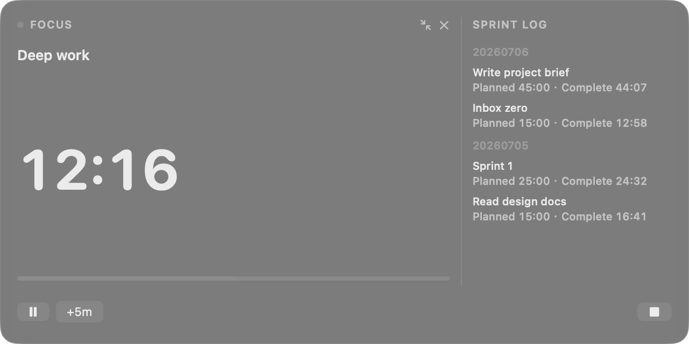
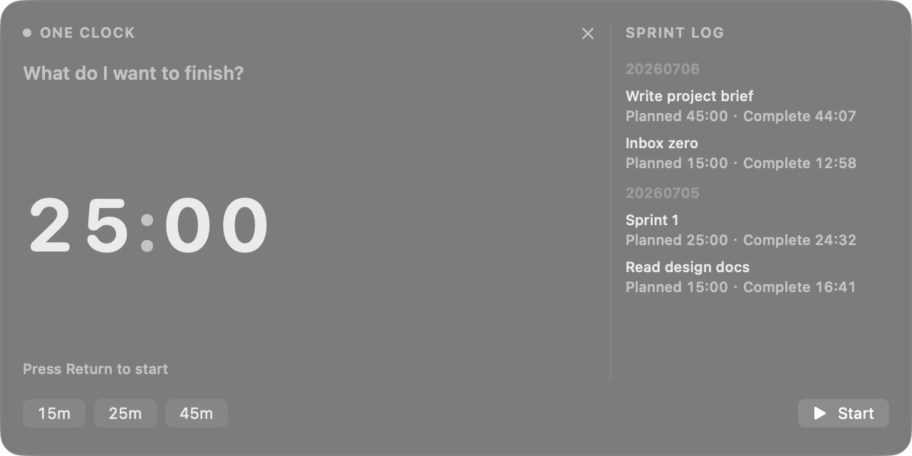
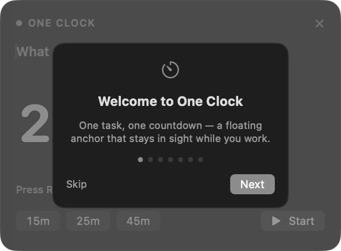

# One Clock

[](https://github.com/andrehungmy/one-clock/actions/workflows/ci.yml)

A macOS menu bar focus timer that keeps one task and its remaining time visible while you work.

> Project status: early source build (`0.1.0`). One Clock does not have a signed download or GitHub Release yet. Build it locally with Xcode to try it.



## Why One Clock

Most focus timers disappear behind other windows or grow into task management systems. One Clock keeps the current task and timer in view, then gets out of the way.

## What It Does

- Runs one focus sprint at a time.
- Shows the countdown in the menu bar and a movable floating panel.
- Supports pause, resume, finish, overtime, and `+5m` adjustments.
- Collapses into a compact pill or hides while the timer keeps running.
- Restores an active sprint as paused after relaunch without counting time while the app was closed.
- Records completed sprints and exports Markdown or JSON.
- Stores data on the Mac. The app has no account, analytics, or network service.
- Keeps one app instance running, even if macOS receives another launch request.

The floating panel stays on one macOS Space at a time. Reopening it from another Space moves it to the current Space. It can appear over full-screen apps.

## Build and Run

### Requirements

- macOS 14 or later
- Xcode 16 or later with Swift 6 support

### Local build

```sh
git clone https://github.com/andrehungmy/one-clock.git
cd one-clock
./script/build_and_run.sh
```

The script builds into a temporary `DerivedData` directory, stops any running development build, and opens the new app. One Clock runs in the menu bar and does not show a Dock icon.

If the menu bar is crowded or the One Clock item is not visible, press
`Control-Option-Space` to show the floating panel. Opening One Clock again also
brings the existing instance's panel forward instead of starting a duplicate.

If the repository sits in an iCloud-synced Desktop or Documents folder, keep `DerivedData` outside that folder. The included scripts already do this. Override the location when needed:

```sh
ONECLOCK_DERIVED_DATA=/path/to/DerivedData ./script/build_and_run.sh
```

## Use One Clock

1. Enter a task name or leave it empty for an automatic `Sprint N` name.
2. Set `MM:SS` by selecting a digit, or choose `15m`, `25m`, or `45m`.
3. Press Return or select Start.
4. Pause, resume, add five minutes, or finish from the panel or menu bar.
5. Collapse the panel when you need more screen space; Finish remains available in the compact pill. Hiding the panel keeps the timer running.
6. Finish the sprint to record the result and prepare the next sprint.

Press `Esc` to hide the panel. Select the menu bar item to show it again, export the sprint log, reopen the tutorial, or quit.
Press `Control-Option-Space` from any app to bring the panel back.

## Current States

| State | Main actions | Timer behavior |
|---|---|---|
| Setup | Set time, choose a preset, start | No active sprint |
| Running | Pause, `+5m`, finish | Counts down |
| Paused | Resume, `+5m`, finish | Holds the current value |
| Overtime | Pause, `+5m`, finish | Counts up after `00:00` |
| Complete | Rename, create a new sprint | Shows invested time |

One Clock saves an exact paused recovery checkpoint during a normal Quit and refreshes the checkpoint every five seconds while a sprint is running. Relaunch always restores the sprint as Paused or Overtime Paused. Time while the app was closed does not reduce Remaining Time or increase Focused Time or Overtime. A crash or force quit can discard up to about five seconds since the last checkpoint; it never counts offline time as focus. Hiding the panel keeps the live sprint running.

## Screenshots

Set up a sprint and widen the panel to reveal the log:



Collapse the active sprint into a compact pill with direct access to Finish:


Open the first-run tutorial from the panel or menu bar:



## Data and Privacy

One Clock stores the active sprint, preferences, and sprint log in the app's local `UserDefaults` container. It does not send usage or task data to a server. Log export writes only to the location selected in the macOS save panel.

Removing a sandboxed build also removes data in its app container unless you export the log first. Data from older non-sandboxed development builds is not migrated.

## Development

Run the complete test suite:

```sh
./script/test.sh
```

The code separates the timer state machine from SwiftUI and AppKit:

```text
OneClock/
  App/       App lifecycle, menu bar, notifications, sound, export
  Domain/    Pure sprint state and transition logic
  State/     Session coordination and local persistence
  Views/     SwiftUI presentation
  Window/    Floating NSPanel lifecycle
OneClockTests/
```

See [CONTRIBUTING.md](CONTRIBUTING.md) for the verification checklist. [PROJECT_AUDIT.md](PROJECT_AUDIT.md) records the current product and engineering assessment. [ROADMAP.md](ROADMAP.md) lists the recommended order of work and open product decisions.

## Distribution Status

The project enables App Sandbox and Hardened Runtime. A public distribution still needs:

- A production bundle identifier and Apple signing identity.
- A signed and notarized build.
- An asset-catalog app icon and release metadata.
- A tested install and upgrade path.

Until those items are complete, treat the repository as a development build rather than an installable release.

## License

[MIT](LICENSE)
